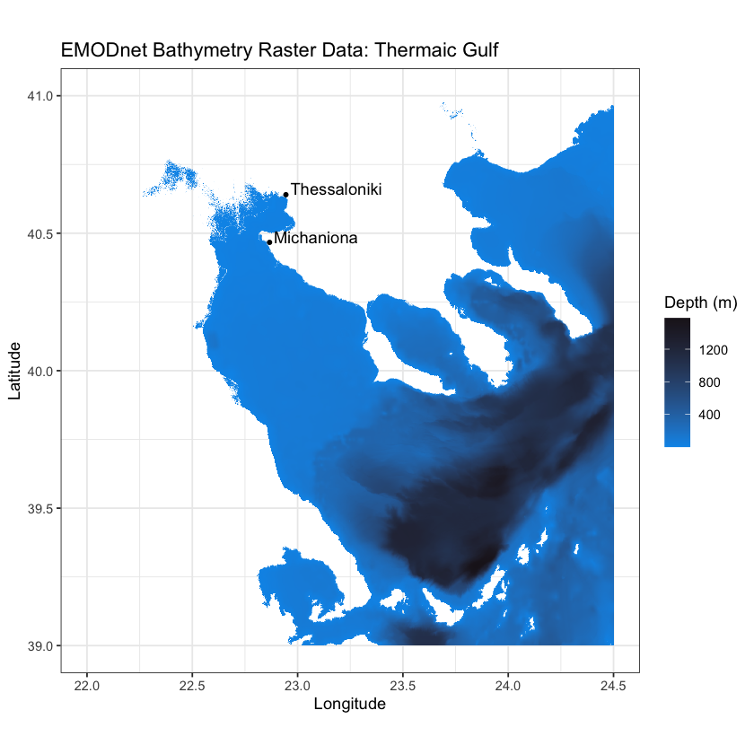
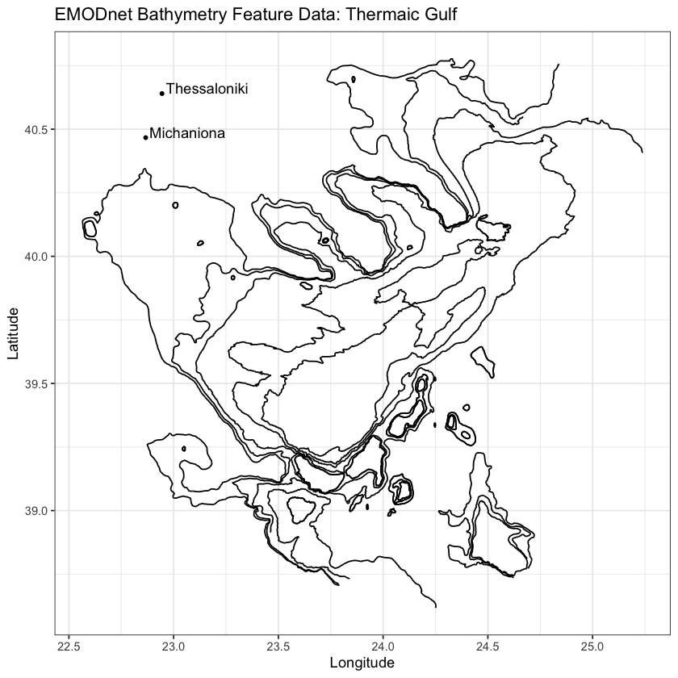
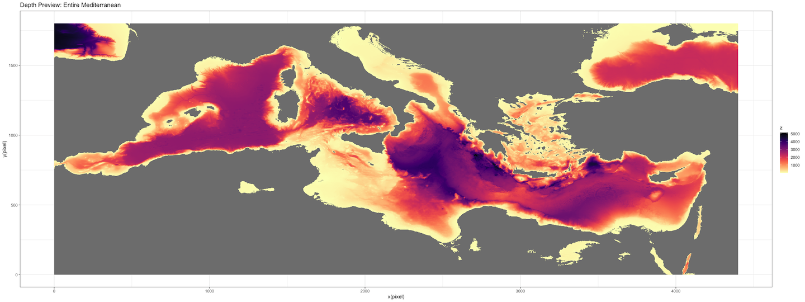
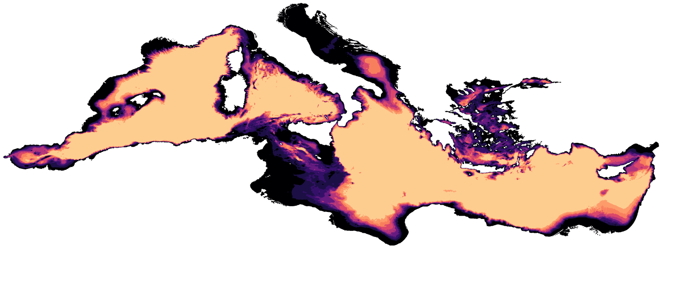
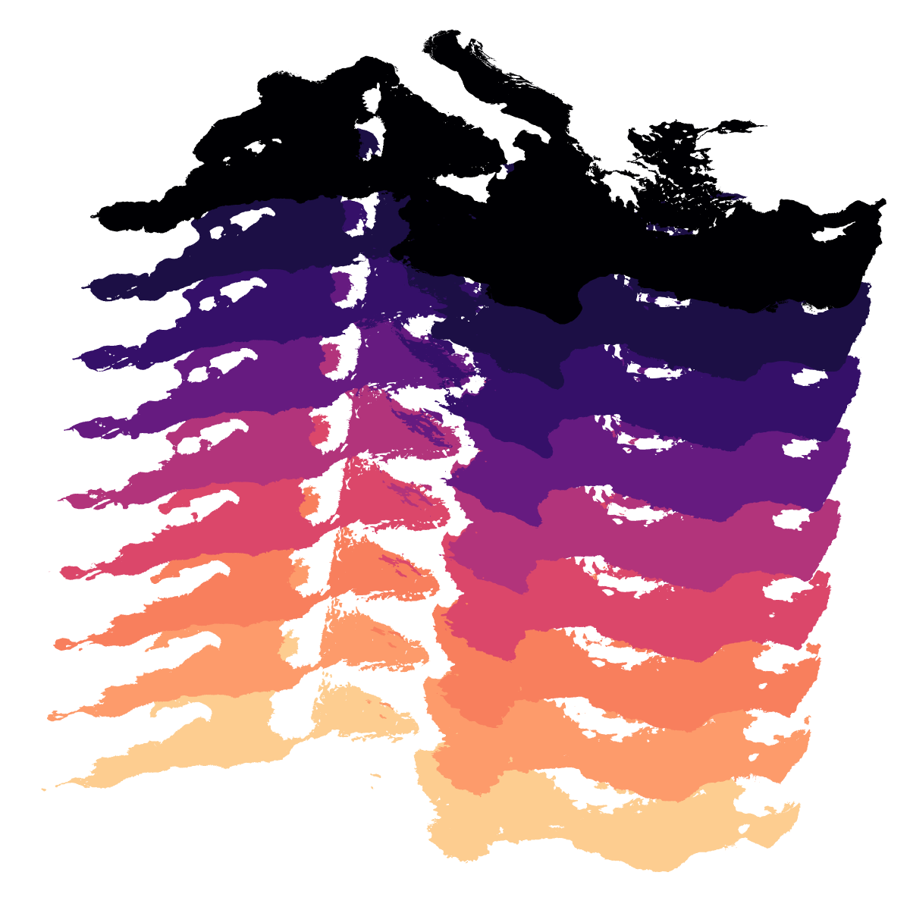

# What:
The code in this repo approximately maps how the Mediterranean Sea shrunk during the Messinian salinity crisis with modern bathymetric data.  Also, if you're curious, _"bathymetry"_ means "depth measurement", so it is sort of like topography for the bottom of the ocean.
# Why:
I'd like to learn R, and to learn a bit more about geospatial data.  If I'm a data scientist, it's about time I learn some R, and if I'd like to do work concerning the environment, then it's about time I learn how to work with geospatial data.  I'd also like to have some high-resolution images of the Mediterranean sinking for the logo for another project (@Salinity-Crisis-Interactive).
# Code Information:
The real work of this project exists in the notebook `./wcs_contour_functions.ipynb` and `contour_funnctions.r`. Also, there are some post-processing functions in `./util/`.  

The rest of the scripts in `./r_tutorial/` and `./r_development/` were just used to explore tools and create some interesting figures.
# Stack:
- R
- Python
- Jupyter
## Libraries:
I've included an R script, `installs.r`, which you may just run in your REPL with
```R
source("installs.r")
```
if you'd like to install the libraries required to run my code.  Ι'm also working on publishing an R package with GitHub packages.
# Data:
[Bathymetric data](https://emodnet.ec.europa.eu/en/emodnet-web-service-documentation#data-download-services) collected by many organizations & provided over the web by the European Commission's European Marine Observation and Data Network (EMODnet).
## Terminology & Definitions:
Embarking on this project forced me to learn what a lot of this stuff is, and I don't want anyone to get confused, so here is my brief overview:

_The European Commission_ (a governing body in the European Union) funds/organizes a network of different oceanographic entities called _European Marine Observation and Data Network (EMODnet)_.  _EMODnet_ has central hub of web services, called the _Online Web Services (OWS)_. It hosts all sorts of geospatial marine data, like Plankton density, bathymetry (sea basin topography), and geologic surveys, often in several different data formats and protocols.  

The _EMODnet_ _OWS_ has quite a few different types of data download services available.  This repository takes advantage of just two:
### _Web Coverage Service (WCS):_
The _**Web Coverage Service (WCS)_ is an implementation of data accessible over the internet.  It is called _WCS_ because it complies with the _Open Geospatial Consortium (OGC)'s_ extremely complicated requirements to be a _WCS._  The _OGC_ is some kind of cooperative entity that is supposed to create standards to make geospatial data more accessible.  _EMODnet_ has some data that is only available through their _WCS,_ like raster data. [See link.](https://emodnet.ec.europa.eu/en/emodnet-web-service-documentation#data-download-services)
#### Example:

### _Web Feature Service (WFS):_
The _**Web Feature Service (WFS)_ is different implementation of data accessible over the internet.  It is called _WFS_ because it complies with the _OGC's_ extremely complicated requirements to be a _WFS._  Again, certain data is only accessible through the _WFS,_ like features and vector data. [See link.](https://emodnet.ec.europa.eu/en/emodnet-web-service-documentation#data-download-services)
#### Example:

## Fetching Data:
Using _WFS_ and _WCS_ are very similar.  You pass all of the input data to the service via a URL.  This is data such as coordinates to specify the area you'd like the data for, resolution, service type, file format, etc.  Here is an example _WCS_ request:

_https://ows.emodnet-bathymetry.eu/wcs?service=wcs&version=1.0.0&request=getcoverage&coverage=emodnet:mean&crs=EPSG:4326&BBOX=22,39,24.5,41&format=image/tiff&interpolation=nearest&resx=0.001&resy=0.001_

A server on their end will do some work, and then you should have a JSON, or a TIFF, or some kind of file returned to you by that call.
### How do you know how to fetch data?
On the _OWS_ [page I keep referencing](https://emodnet.ec.europa.eu/en/emodnet-web-service-documentation#data-download-services), they list a bunch of calls you can make to the server to show capabilities in an XML metadata format for some reason.  BUT, [these example R notebooks](https://github.com/EMODnet/Web-Service-Documentation/tree/main) that _EMODnet_ compiled give a lot of guidance as well.

#### Difficulties with that tutorial and modern R:
Several of the spatial data packages used in the [_EMODnet_ _OWS_ tutorial](https://github.com/EMODnet/Web-Service-Documentation/tree/main/R-tutorial), such as `rgdal` and `maptools` are out-of-maintenance or not on C.R.A.N. anymore.  Some of their functionality has been absorbed into `terra` (kind of a master geospatial library) and `sf`.  Most of the functionality seems to remain, but switching over from the methods they used is somewhat difficult because they just handle data with different R objects, etc.  Just be warned that certain functions like `rgdal::readOGR()` are no longer maintained, and spiritually replaced by methods like `terra::vect()`.

# Results:
Stitched-together tiles of _WCS_ bathymetry raster data:


Contours from sea-level to 1500m, colored accordingly, with non-Mediterranean bodies of water removed:


Same contour shapes arranged to create a logo:



# Resources:
1. [_EMODnet_ _OWS_ R Tutorial](https://github.com/EMODnet/Web-Service-Documentation/tree/main/R-tutorial)
2. [Paradis' R Tutorial](https://cran.r-project.org/doc/contrib/Paradis-rdebuts_en.pdf)
